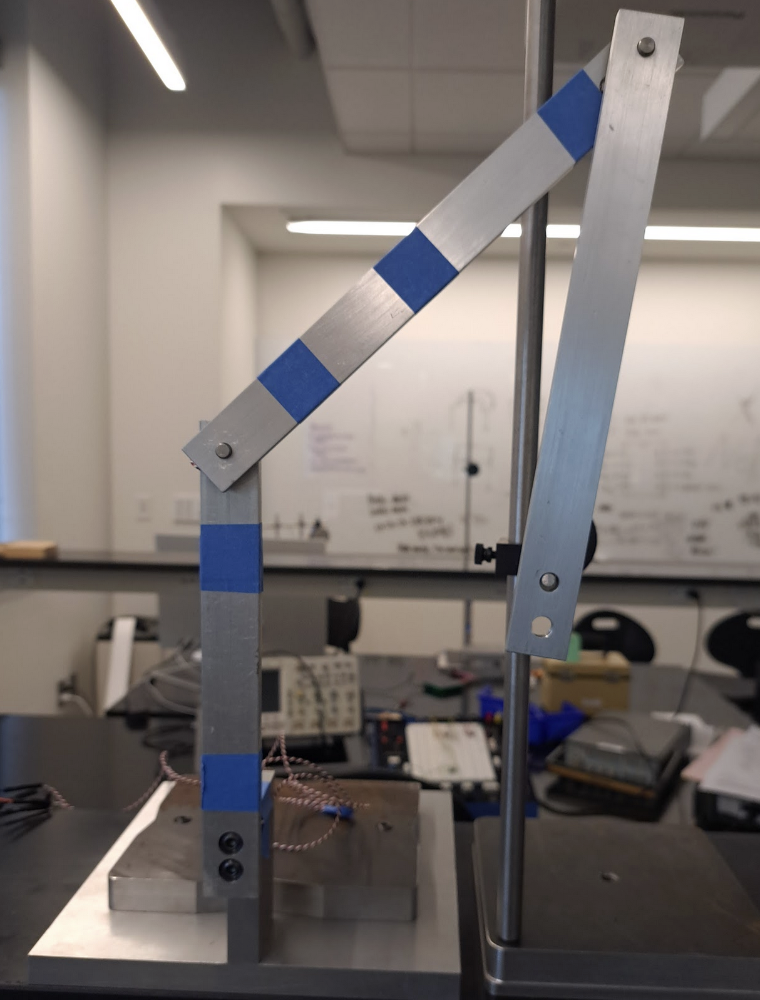
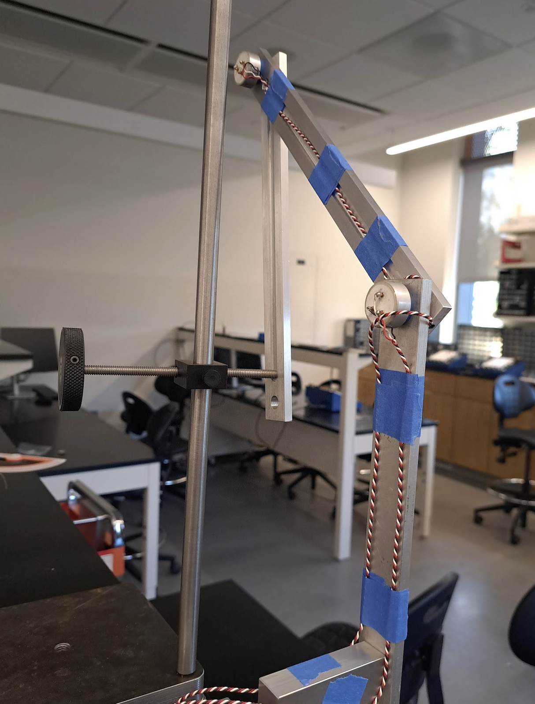
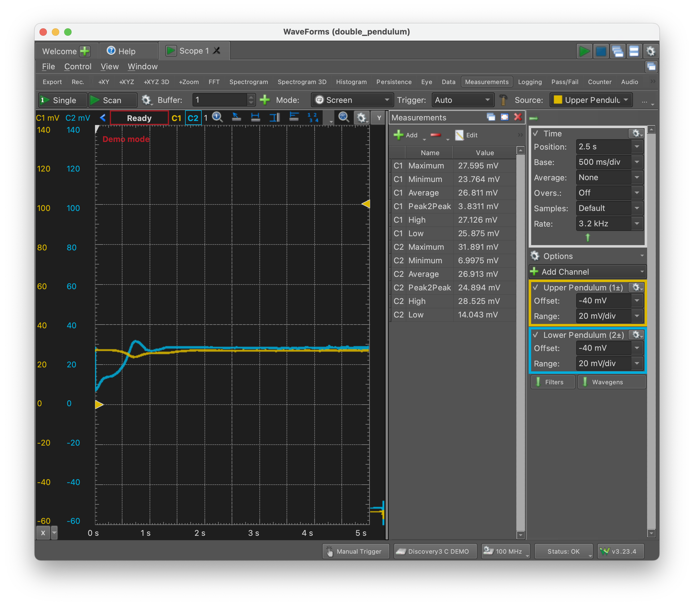
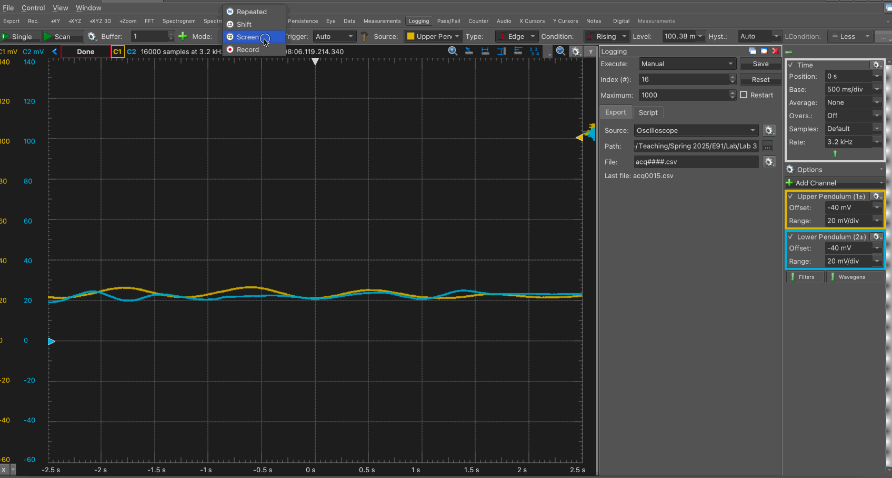
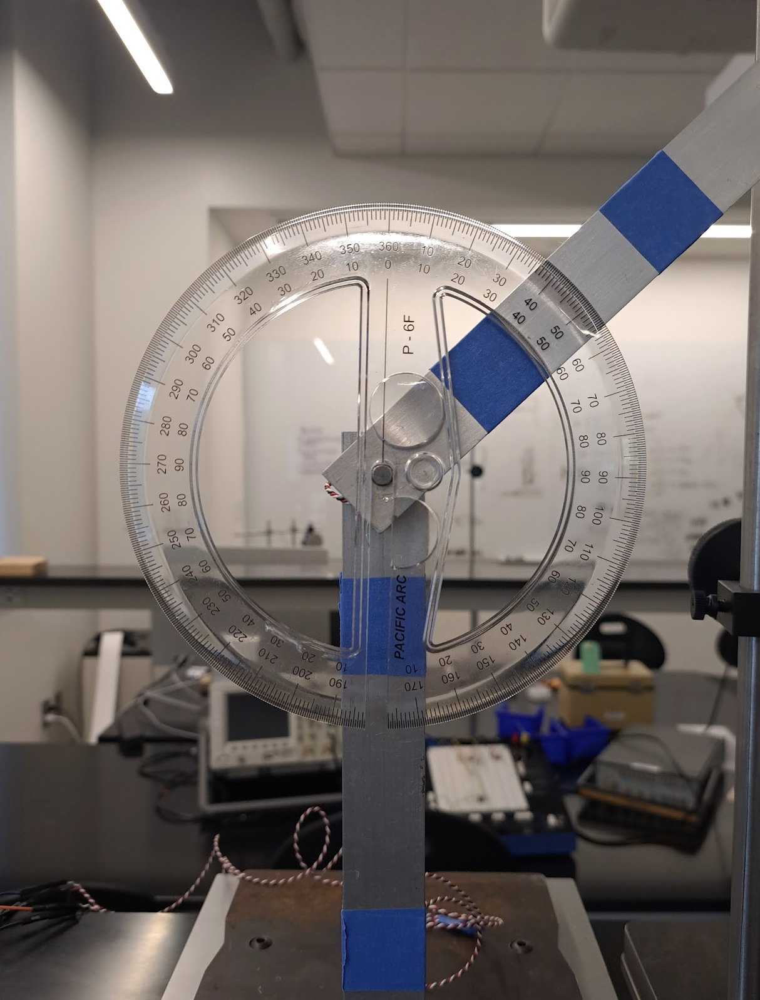
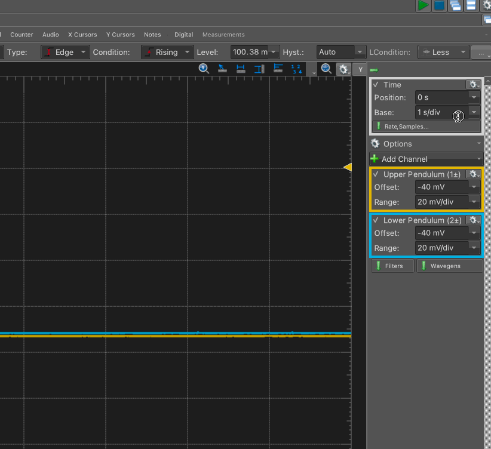
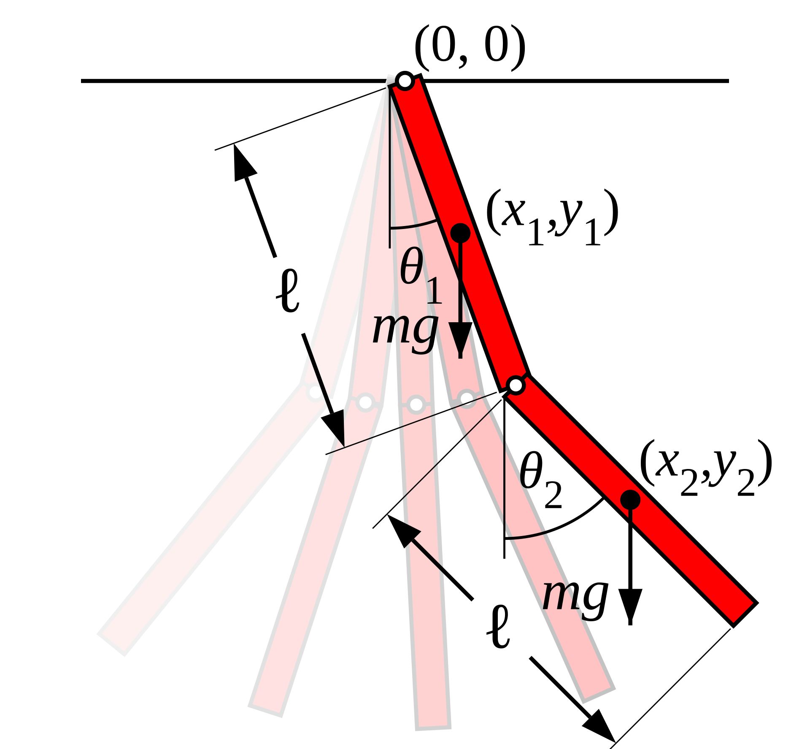

# Double Pendulum Lab 

The double pendulum is a simple mechanical system that, in theory, can exihibit signs of chaos. In this lab, you will use two interconnected 'compound pendulums' and investigate the degree to which their combined behavior is nonlinear and chaotic. You should think of this lab as a follow-on to Lab 1, where you investigated the behavior of a _single_ compound pendulum swinging at large angles.

## Setup and Logistics

This lab is self-scheduled. You will have some time during class to get started, and you should complete data collection by **Friday, May 2nd**.
This lab will be held in Singer Hall 246 using 4 lab computers. Once your group starts working at one station, it is recommended that you complete the entire lab at that station. You have access to SH 246 at any time of day.

### Equipment and hardware

This lab makes use of two aluminum bars. The first aluminum bar --- labeled the **Upper Pendulum** --- is attached to a fixed stand, while the second bar --- labeled the **Lower Pendulum** --- is attached to the lower end of the upper pendulum. Each attachment point is a [Vishay Spectrol 157-11103](https://www.vishay.com/docs/57042/157.pdf) potentiometer, which provides a voltage reading that is expected to scale, hopefully linearly, with the angle of rotation of the shaft. The potentiometers are already wired up and connected to the data collection device.

{:style="max-width: 45%; height: auto;"} {:style="max-width: 45%; height: auto;"}

In addition to the pendulum itself, this lab involves the use of a release mechanism that will allow you to reliably repeat experiments. The release mechanism takes the form of a simple hand-driven screw on which the lower pendulum can rest in a configuration of your choice, as shown below. Dynamic experiments are started by retracting the screw and letting the pendulum fall with zero initial speed.

{:style="max-width: 50%; height: auto;"}

Data collection is carried out using the [Analog Discovery 3](https://digilent.com/shop/analog-discovery-3/), a multi-purpose data collection device that here provides power and ground to the potentiometers and reads the analog output from them into an oscilloscope software on the lab workstations.

### Software

This lab uses Digilent Waveforms, similar to Lab 1. A collection of settings and variable names in Waveforms is called a 'workspace'; download the workspace for this lab at the following locations:
- [Station 1](https://drive.google.com/file/d/1lmh2NXNRG0dyjZV_piCmQ6I-xZLXqV9j)
- [Station 2](https://drive.google.com/file/d/1RFe-NDDfgFkGpnzPpPt4HR_JhWBVhsVn/view?usp=sharing)
- [Station 3](https://drive.google.com/file/d/13-X-gba0pyKC4v7PUUqRmxb6zQ9JupKs/view?usp=sharing)
- [Station 4](https://drive.google.com/file/d/1e369oFQncSamTyL7yvseJu5QSjN-Bjd0/view?usp=sharing)

Waveforms has already been installed on the lab computers. Should you need to install it on your personal computer, you can download it [here](https://tinyurl.com/E91LabSoftware). A reference manual is available [here]().

{:style="max-width: 60%; height: auto;"}

### Recording Data

There are a few different ways of recording data using Waveforms.
1. Using the 'Logging' panel while 'Mode' is set to 'Screen'. In this method, you will capture everything you see currently on the oscilloscope into a csv file with a pre-set name, for example `test-0001.csv`, `test-0002.csv`. The system will automatically increment names and --- if you select 'Manual' execution --- collect this data whenever you click on Save in the 'Logging' panel. It may be a good idea to use this method for calibration.
2. Using the 'Mode: Record' setting. In this setting, you can use a Configuration button to collect data using a certain smaple rate for any number of seconds. This gives you more fine-tuned control over how your data is collected.
3. You can use any combination of these and other settings to collect data.

{:style="max-width: 90%; height: auto;"} 

{:style="max-width: 90%; height: auto;"}

### Calibration and initial setup

Just like lab 1, you will need to calibrate the two pendulums. For this purpose, you have a 360-degree protractor. Use this portractor to record the voltage values for the following fifteen angles, measured counterclockwise with zero being the stable, at-rest position. Collect data for **5 seconds** when calibrating.

Remember that you need one calibration set for **each pendulum** for a total of 15x2=30 calibration `csv` files.

| No. | Angle |
|-----|-------|
| 1   | 0     |
| 2   | 10    |
| 3   | 30    |
| 4   | 60    |
| 5   | 90    |
| 6   | 120   |
| 7   | 150   |
| 8   | 170   |
| 9   | 190   |
| 10  | 210   |
| 11  | 240   |
| 12  | 270   |
| 13  | 300   |
| 14  | 330   |
| 15  | 350   |

{:style="max-width: 90%; height: auto;"}

#### Oscilloscope settings

Set the horizontal and vertical scaling and offset in such a way that you can view the interesting dynamical behavior 'in one go'. This means that you may have to change the 'Base' setting on the 'Time' panel and the 'Offset' and 'Range' settings on the 'Channel' panels, as shown below.

{:style="max-width: 80%; height: auto;"} 

{:style="max-width: 80%; height: auto;"}

However, you should start with the default settings in the workspace files you downloaded, and hopefully you won't need to change anything.

## Theory

The motion of a compound double pendulum can be described using just two coordinates: $\theta_1$ and $\theta_2$ as shown in the diagram below.

{:style="max-width: 60%; height: auto;"}

Since the pendulums are rigid bodies, it is sufficient to track the motion of their centers of mass. We can write their positions as

{:style="max-width: 60%; height: auto;"}

and their velocities, after differentiating with respect to time, are:

{:style="max-width: 60%; height: auto;"}

With this information at hand, we can write the potential and kinetic energies of the system, which then yields an expression for the Lagrangian. ...

The Euler-Lagrange equation 

{:style="max-width: 60%; height: auto;"}

can then be used for each coordinate, where the term `n.c.f` refers to non-conservative body forces, in this case, friction. We will use, for the friction, a simple term of the form

{:style="max-width: 10%; height: auto;"}

where 'c' is a constant friction coefficient.

## Tasks

There are four tasks, each of which involve collecting data (which you must do in the lab) and analyzing it (which you can do at home).

1. Repeatability
2. Predictability
3. Angular Velocity data
4. Comparison with numerical simulation

### Repeatability

1. Choose an initial condition that yields interesting, nonlinear dynamics with **multiple 360-degree turns of the lower pendulum** and, preferably, at least **one 360 degree turn of the upper pendulum**. Once you have found such an initial condition, photograph your initial condition and read the two angles using the protractor.
2. Record (on the oscilloscope) five releases from the same spot.
3. On the same set of axes, plot the two angles versus time using a color scheme that allows for a meaningful comparison between the five runs. There will be ten curves, so choose your line styles wisely. 
4. On the same set of axes, draw a 'phase plot' showing the two angles plotted against each other. There will be five curves on this graph.

### Predictability

Choose an initial condition for which you see **multiple 360-degree turns of the lower pendulum** and **no 360-degree turns of the upper pendulum**. Count the number, direction, and order of 360-degree turns of the lower pendulum. For example, a complete record of one experiment could be:
- clockwise turn `-360`
- counterclockwise turn `+360`
- counterclockwise turn `+360`
- clockwise turn `-360`

1. Conduct three runs from your chosen initial condition and reord the number, direction and order of 360-degree turns of the lower pendulum each time.
2. Change the initial condition by moving the point of release a few centimeters up, down, left, or right, and repeat the exercise. Do you observe the same number, direction and order of 360-degree turns? Conduct three runs here, too.
3. Repeat using the same distance in all four directions, i.e., if you moved the initial release location five centimeters to the right, then repeat with five centimeters to the left, five centimeters above, and five centimeters below the original release point.

For this part, you are advised to use the protractor to note down the initial angles.

### Obtaining angular velocity data

The potentiometers only report angular position, not angular velocity. For one set of initial conditions --- different from the 'repeatability' section --- use a program such as [MATLAB's diff function](https://www.mathworks.com/help/matlab/ref/double.diff.html) to generate a phase plot in which you show the angular position on the horizontal axis and the angular velocity on the vertical axis. You may choose to do this for an initial conditions with no 360-degree turns if you wish.

### Comparison with numerical simulation

Choose two initial conditions. 
1. For one set of initial conditions, choose a release location for which there is only mildly nonlinear behavior and no 360-degree turns. 
2. For the second set of initial conditions, choose a release location for which there is strongly nonlienar behavior with multiple 360-degree flips.

For each initial condition, record the initial angles using the protractor (even though you have already carried out calibration). Then, compare the behavior of the physical pendulum with a numerical solution of the governing equations with the same initial condition. You are welcome to modify the code available [here](../Resources/#the-double-pendulum) for this purpose, or you can write your own solution. You will have to choose a suitable value for the fruction coefficient of each pendulum.

By tuning the chosen values of the two friction coefficients, how close an agreement are you able to bring between the numerical solutions and the physical data? You may wish to use accurate values of the mass and length of the pendulums, and to ensure that all terms in the equation are in the correct units.

Plot your results in any suitable form of your choice.

